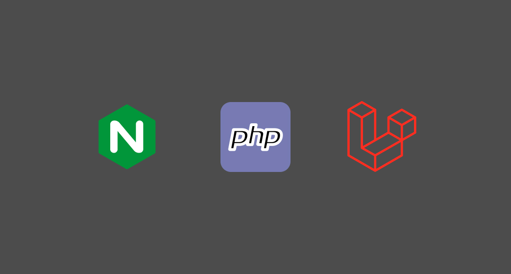

# Overview
An environment with PHP-FPM and Nginx, prepared to serve local Laravel apps.
This will make your development process more realistic and closer to a production environment.

# Creating a project
*This section will be completed soon.*

# Usage on an existing project
1. Clone or download this repository;
2. Copy the `docker-compose.yml` file and the `environment-files` folder,
then paste them into your Laravel project directory;
3. In your `.env` file, add these variables:
```env
APP_PORT=
USERNAME=
NODE_MAJOR=
```
> * `APP_PORT` must be the port you want to use to serve the app on your machine;
> * `USERNAME` must be your username. This allows you to edit the code and enables your app to register logs in the storage folder;
> * `NODE_MAJOR` must be the version of Node that you want.
4. Now, run the following command:
```bash
$ sudo docker compose up -d
```
5. Install the framework:
```bash
$ sudo docker compose exec app composer install
```
1. Generate the key for your project (only if the key doesn't exist in the `.env` file):
```bash
$ sudo docker compose exec app php artisan key:generate
```
#### Congratulations! Your app is now being served!