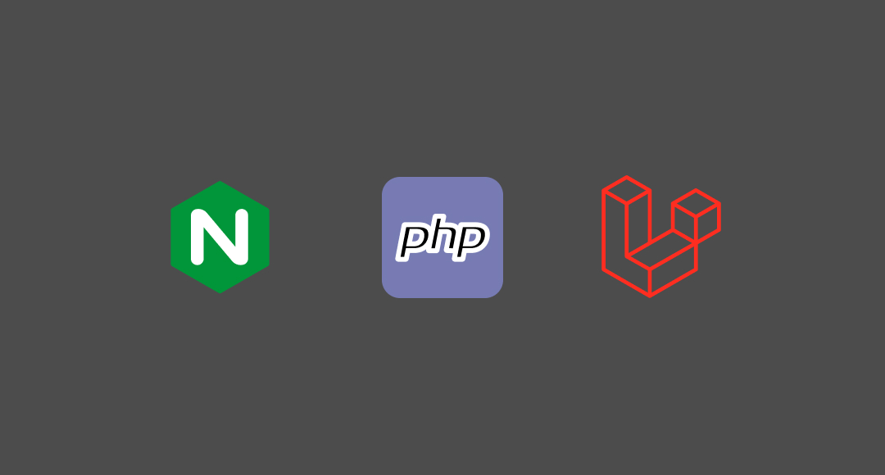

# Overview
An environment with PHP-FPM and Nginx, prepared to serve local Laravel apps.
This will make your development process more realistic and closer to a production environment.

# Usage
1. Download this repository and open a terminal in its directory;
2. We need to build the image: 
```bash
$ sudo docker build -t my-username/my-image --build-arg user=<your-system-username> --build-arg node=22 ./environment-files/ 
```
> Your terminal must be open in this directory.
> * After `-t`, you must specify the name you want for the image;
> * In `<your-system-username>`, you must specify your operational system's username;
> * In `node`, you must specify the version of Node that you want.

Example: 
In my case, the command is as follows:
```bash
$ sudo docker build -t matheusbrdev/php-fpm:8.3 --build-arg user=matheusbrdev --build-arg node=22 ./environment-files/ 
```

sudo docker container run -d --rm -v "$(pwd)/":/var/www/html matheusbrdev/php-fpm:8.3 composer create-project "laravel
/laravel:^11" migrations

# Creating a project 
1. Clone or download this repository;
2. Create a folder for your project;
3. Copy the `docker-compose.yml` file and the `environment-files` folder,
then paste them into the folder you created;
4. Create a `.env` file(for the Dockerfile build process) with the following content:
*This step is only necessary if you haven't done it before* 
```env
APP_PORT=
USERNAME=
NODE_MAJOR=
```
> * `APP_PORT` must be the port you want to use to serve the app on your machine;
> * `USERNAME` must be your username. This allows you to edit the code and enables your app to register logs in the storage folder;
> * `NODE_MAJOR` must be the version of Node that you want.
5. Now, run the following command:
```bash
$ sudo docker compose up --build -d
```
> If you have already completed the build process before, you don't need the `--build` flag.

# Usage on an existing project
1. Clone or download this repository;
2. Copy the `docker-compose.yml` file and the `environment-files` folder,
then paste them into your Laravel project directory;
3. In your `.env` file, add these variables:
*This step is only necessary if you haven't done it before* 
```env
APP_PORT=
USERNAME=
NODE_MAJOR=
```
> * `APP_PORT` must be the port you want to use to serve the app on your machine;
> * `USERNAME` must be your username. This allows you to edit the code and enables your app to register logs in the storage folder;
> * `NODE_MAJOR` must be the version of Node that you want.
4. Now, run the following command:
```bash
$ sudo docker compose up --build -d
```
5. Install the framework:
```bash
$ sudo docker compose exec app composer install
```
6. Generate the key for your project (only if the key doesn't exist in the `.env` file):
```bash
$ sudo docker compose exec app php artisan key:generate
```
#### Congratulations! Your app is now being served!